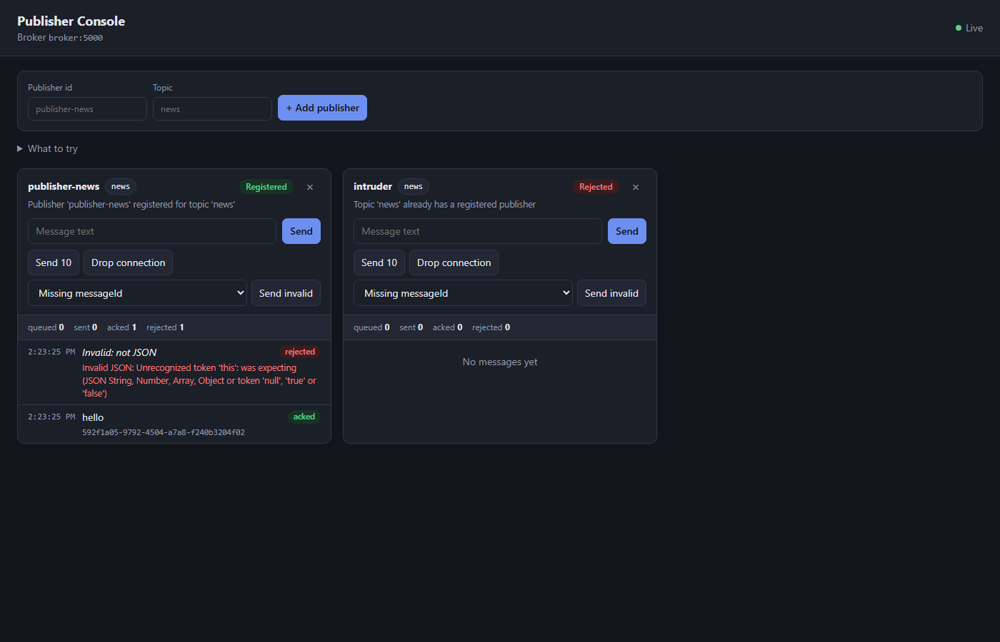

# Publisher (Node.js + TypeScript)

The publisher for the project broker. It has two modes that share the same connection logic
(`src/publisherClient.ts`):

- **Web UI** (`--ui`): a local web page for running several publishers at once, with buttons
  that demonstrate the broker's features. Best for showcasing the system.
- **Terminal**: one publisher; every line you type is published.

In both modes, each publisher opens one TCP connection, registers a fixed `publisherId` for one
`topic`, and sends each message as an NDJSON `publish` frame with a UUID `messageId` and an
ISO-8601 timestamp. It reconnects automatically with exponential backoff (1–30 seconds).
Messages published while disconnected are queued and sent after registration succeeds.
Messages that were sent but not yet confirmed when the connection dropped are resent with the
same `messageId`.

The broker must already be running. By default, the publisher connects to `127.0.0.1:5000`.

## Web UI

```bash
npm install
npm run ui                               # broker 127.0.0.1:5000, UI on http://localhost:3000
npm run ui -- 127.0.0.1 5000 3000        # [brokerHost] [brokerPort] [uiPort]
```

Open http://localhost:3000, add a publisher (id + topic), and send messages.



| Control | What it shows |
|---|---|
| **+ Add publisher** | Each panel is a separate publisher with its own connection. A second publisher on an already-owned topic is shown as *Rejected*, with the broker's reason. |
| **Status badge** | *Connecting* → *Registering* → *Registered*; *Disconnected* shows a countdown to the next reconnect attempt. |
| **Message log** | Each message goes *queued* → *sent* → *acked* (broker's `publish_ack`), or *rejected* with the broker's reason. |
| **Send 10** | Publishes 10 numbered messages at once (ordering). |
| **Drop connection** | Closes the socket as if the network failed; queued messages are sent after the automatic reconnect. |
| **Send invalid** | Sends a broken frame (missing `messageId`, wrong topic, unknown type, not JSON) to show the broker's validation and Dead Letter Queue. |

The UI server listens on `127.0.0.1` only. Set `UI_HOST=0.0.0.0` to expose it on the
network, as the Docker image does.

How it works: `src/ui/server.ts` uses Node's built-in `http` module. The page
(`public/index.html`, plain HTML/JS, no framework) calls a small JSON API to add or remove
publishers and send messages. It receives live updates through Server-Sent Events
(`GET /events`). There are no runtime dependencies.

## Terminal mode

```bash
npm install
npm run dev -- publisher-fotbal fotbal
npm run dev -- publisher-fotbal fotbal 127.0.0.1 5000     # optional broker host and port
```

Type any non-empty line to publish it. Type `/quit` (or press `Ctrl+C`) to close the publisher.

## Compiled run

```bash
npm run build
npm start -- publisher-fotbal fotbal 127.0.0.1 5000       # terminal mode
npm run start:ui                                          # web UI
```

## Source layout

```
src/
├── index.ts             entry point: `--ui` starts the web UI, otherwise terminal mode
├── publisherClient.ts   one broker connection: register, publish, queue, reconnect, track statuses
├── cli.ts               terminal mode
└── ui/server.ts         web UI server (page, JSON API, Server-Sent Events)
public/index.html        the web page
```
