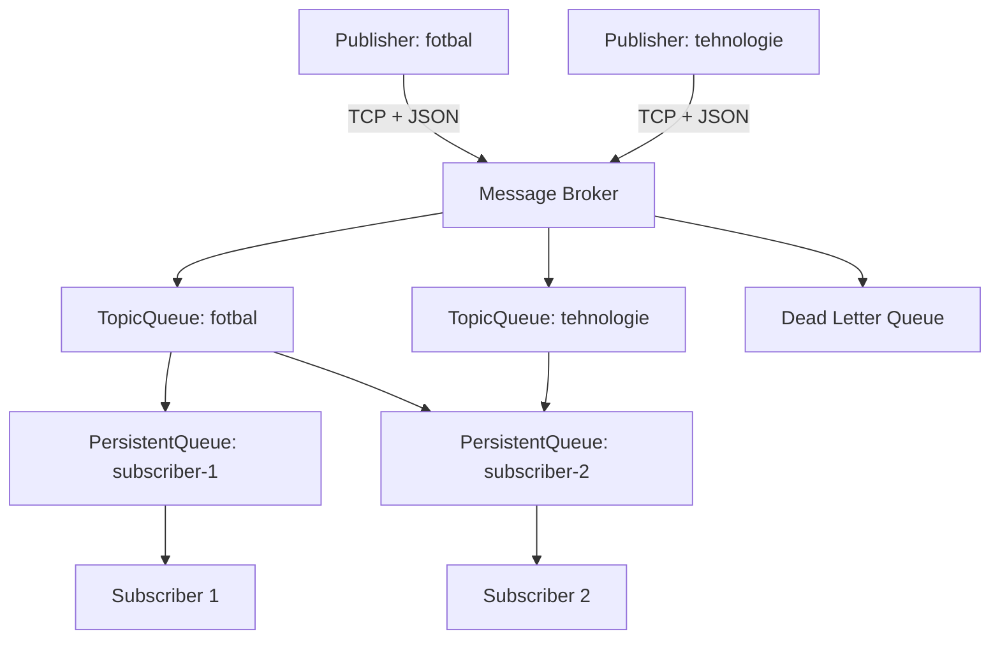
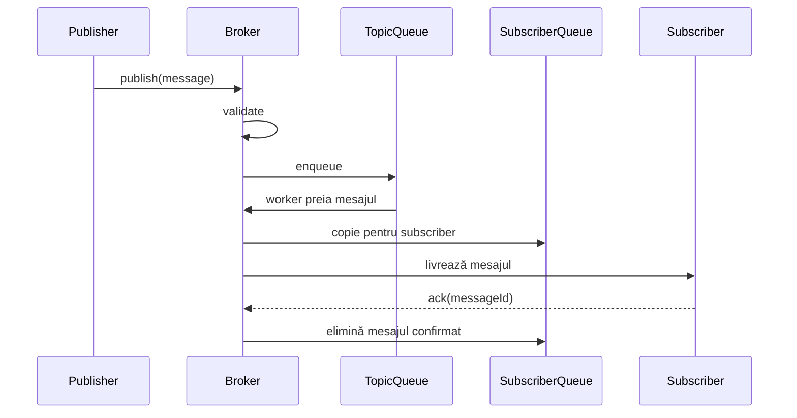

# Sistem Publish–Subscribe — Cerințe și arhitectură

## 1. Descriere generală

Proiectul reprezintă un sistem distribuit de tip **Publish–Subscribe**, format din trei programe independente care comunică prin rețea:

1. **Publisher** — generează și publică mesaje pentru un topic;
2. **Message Broker** — primește, validează, stochează temporar și distribuie mesajele;
3. **Subscriber** — se abonează la un publisher/topic și primește mesajele corespunzătoare.

În cadrul acestui proiect, fiecare publisher este asociat cu **un singur topic unic**. Prin urmare, abonarea la publisher și abonarea la topicul său sunt echivalente.

Exemplu:

| Publisher | Topic |
| --- | --- |
| `publisher-fotbal` | `fotbal` |
| `publisher-tech` | `tehnologie` |
| `publisher-meteo` | `meteo` |

Scopul sistemului este transmiterea concurentă și sigură a mesajelor de la publisheri către toți subscriberii abonați, inclusiv păstrarea mesajelor pentru subscriberii temporar deconectați.

## 2. Obiective

- realizarea comunicării prin rețea între trei programe independente;
- implementarea modelului Publish–Subscribe fără utilizarea unui broker existent precum RabbitMQ sau Kafka;
- crearea dinamică a cozilor în funcție de publisherii/topicurile înregistrate;
- procesarea concurentă a conexiunilor și mesajelor;
- distribuirea fiecărui mesaj către toți subscriberii abonați;
- păstrarea mesajelor nelivrate pentru subscriberii deconectați;
- izolarea mesajelor invalide într-un Dead Letter Queue;
- posibilitatea implementării componentelor în limbaje diferite.

## 3. Arhitectura sistemului



### 3.1 Separarea proceselor

Fiecare componentă trebuie să ruleze ca program/proces separat:

| Componentă | Responsabilitate | Propunere de limbaj |
| --- | --- | --- |
| Publisher | Citește inputul și trimite mesaje | Node.js |
| Message Broker | Gestionează conexiuni, cozi, rutare și persistență | C# |
| Subscriber | Se abonează și primește mesaje | Python |

Limbajele sunt o propunere. Comunicarea dintre componente nu depinde de limbaj, deoarece toate respectă același protocol de rețea și același format JSON.

## 4. Componente

### 4.1 Publisher

Publisherul reprezintă sursa mesajelor.

Responsabilități:

- primește la pornire un `publisherId` și un `topic` prin argumente sau input de la tastatură;
- se conectează la broker prin rețea;
- se înregistrează la broker;
- citește mesajele introduse de utilizator sau le generează automat;
- construiește mesaje în formatul comun;
- trimite mesajele brokerului;
- afișează confirmarea sau eroarea primită de la broker;
- încearcă să se reconecteze dacă legătura este întreruptă.

Regulă: un publisher poate publica numai în topicul cu care a fost înregistrat.

### 4.2 Message Broker

Brokerul este componenta centrală și partea principală a proiectului.

Responsabilități:

- acceptă simultan conexiuni de la mai mulți publisheri și subscriberi;
- identifică tipul clientului și validează cererea de conectare;
- păstrează asocierea dintre publisher și topic;
- creează dinamic o coadă pentru fiecare topic nou;
- primește și validează mesajele publisherilor;
- introduce mesajele valide în coada topicului;
- procesează concurent cozile topicurilor;
- identifică subscriberii abonați la fiecare topic;
- copiază mesajul în coada persistentă a fiecărui subscriber abonat;
- livrează mesajele subscriberilor conectați;
- păstrează mesajele pentru subscriberii deconectați;
- mută mesajele invalide în Dead Letter Queue;
- gestionează confirmarea livrării mesajelor;
- protejează structurile partajate împotriva accesului concurent incorect.

### 4.3 Subscriber

Subscriberul reprezintă consumatorul mesajelor.

Responsabilități:

- primește la pornire un `subscriberId` stabil;
- se conectează la broker;
- transmite topicul/publisherul la care dorește să se aboneze;
- poate păstra una sau mai multe abonări, dacă această extensie este activată;
- așteaptă mesaje fără a bloca funcționarea brokerului;
- afișează mesajele primite;
- confirmă brokerului procesarea fiecărui mesaj prin `ack`;
- la reconectare folosește același `subscriberId` și primește mesajele rămase în coada sa persistentă.

## 5. Modelul cozilor

### 5.1 Coada unui topic — `TopicQueue`

Pentru fiecare publisher/topic, brokerul creează dinamic o coadă:

```text
TopicQueues
├── fotbal      -> [mesaj-1, mesaj-2]
├── tehnologie  -> [mesaj-3]
└── meteo       -> [mesaj-4, mesaj-5]
```

Rolul acestei cozi este să decupleze primirea mesajelor de distribuirea lor. Publisherul poate continua să trimită mesaje, iar un worker al brokerului le preia și le distribuie.

### 5.2 Coada persistentă a subscriberului — `PersistentSubscriberQueue`

Fiecare subscriber are propria coadă persistentă:

```text
SubscriberQueues
├── subscriber-1 -> [mesaj-1, mesaj-2]
└── subscriber-2 -> [mesaj-1, mesaj-2, mesaj-3]
```

Pentru un mesaj publicat în topicul `fotbal`, dacă `subscriber-1` și `subscriber-2` sunt abonați, brokerul creează câte o copie logică pentru fiecare:

```text
TopicQueue[fotbal]
       |
       +--> PersistentQueue[subscriber-1]
       |
       +--> PersistentQueue[subscriber-2]
```

Această operație de **fan-out** asigură că ambii subscriberi primesc același mesaj. Dacă ar consuma direct din aceeași coadă de topic, mesajele s-ar împărți între ei, ceea ce ar reprezenta modelul Work Queue, nu Publish–Subscribe.

Mesajul este eliminat din coada persistentă numai după primirea confirmării `ack` de la subscriber.

### 5.3 Dead Letter Queue — `DLQ`

Dead Letter Queue păstrează mesajele care nu pot fi procesate normal.

Exemple:

- lipsește `topic`;
- lipsește `publisherId` sau `payload`;
- tipul mesajului nu este recunoscut;
- formatul JSON este invalid;
- publisherul încearcă să publice în alt topic;
- mesajul depășește dimensiunea maximă permisă;
- livrarea eșuează de prea multe ori, dacă se implementează limita de retry.

O înregistrare DLQ trebuie să conțină mesajul original, cauza erorii și momentul apariției.

## 6. Fluxurile principale

### 6.1 Înregistrarea publisherului

1. Publisherul se conectează la broker.
2. Trimite `publisherId` și `topic`.
3. Brokerul validează unicitatea lor.
4. Dacă topicul nu există, brokerul creează `TopicQueue` și pornește workerul aferent.
5. Brokerul confirmă înregistrarea.

### 6.2 Abonarea subscriberului

1. Subscriberul se conectează cu un `subscriberId` stabil.
2. Trimite o cerere de abonare la un topic.
3. Brokerul verifică existența topicului.
4. Brokerul salvează abonarea.
5. Brokerul creează sau recuperează coada persistentă a subscriberului.
6. Dacă există mesaje nelivrate, începe retransmiterea lor.

### 6.3 Publicarea și distribuirea



Pașii logici:

1. Publisherul trimite mesajul brokerului.
2. Brokerul validează mesajul.
3. Mesajul valid este introdus în `TopicQueue`.
4. Workerul topicului preia mesajul.
5. Brokerul găsește toți subscriberii abonați.
6. Mesajul este copiat în coada persistentă a fiecărui subscriber.
7. Pentru subscriberii online începe livrarea.
8. Pentru subscriberii offline mesajul rămâne salvat.
9. După `ack`, mesajul este eliminat din coada subscriberului respectiv.

### 6.4 Mesaj invalid

1. Brokerul primește mesajul.
2. Validarea eșuează.
3. Brokerul nu introduce mesajul în `TopicQueue`.
4. Creează o înregistrare în DLQ cu motivul respingerii.
5. Trimite publisherului un răspuns de eroare.

### 6.5 Reconectarea subscriberului

1. Subscriberul se reconectează cu același `subscriberId`.
2. Brokerul îi restabilește abonările.
3. Brokerul citește mesajele neconfirmate din coada sa persistentă.
4. Mesajele sunt retransmise în ordinea stabilită.
5. Fiecare mesaj confirmat este eliminat din coadă.

## 7. Concurență și multithreading

Brokerul trebuie să permită:

- conectarea simultană a mai multor clienți;
- primirea concurentă a mesajelor de la publisheri diferiți;
- procesarea independentă a topicurilor;
- livrarea concomitentă către mai mulți subscriberi;
- continuarea funcționării chiar dacă un client este lent sau deconectat.

Model recomandat în broker:

- câte un `Task`/thread logic pentru gestionarea fiecărei conexiuni;
- câte un worker pentru fiecare `TopicQueue`;
- operații asincrone pentru citirea și scrierea în rețea;
- colecții thread-safe pentru cozi, publisheri, subscriberi și abonări;
- mecanisme de semnalizare pentru ca workerii să aștepte eficient când o coadă este goală.

Structuri C# posibile:

```csharp
ConcurrentDictionary<string, TopicState> topics;
ConcurrentDictionary<string, SubscriberState> subscribers;
Channel<Message> topicQueue;
```

`Channel<T>` este potrivit pentru scenariul producător–consumator, deoarece poate oferi o coadă sigură pentru concurență și așteptare asincronă. Alternativ se poate utiliza `BlockingCollection<T>` sau `ConcurrentQueue<T>` împreună cu un mecanism de semnalizare.

Nu este necesară atribuirea manuală a threadurilor către nuclee CPU. Schedulerul sistemului de operare poate executa taskurile/threadurile pe nucleele disponibile.

### Cerințe de siguranță concurentă

- două threaduri nu trebuie să creeze simultan două cozi pentru același topic;
- un mesaj nu trebuie distribuit de două ori din cauza unei race condition;
- modificarea abonărilor nu trebuie să corupă lista subscriberilor;
- scrierea persistentă trebuie sincronizată;
- un subscriber lent nu trebuie să blocheze ceilalți subscriberi;
- ordinea mesajelor unui topic trebuie păstrată conform politicii stabilite.

## 8. Persistență

Persistența are două scopuri:

1. păstrarea abonărilor și a cozilor subscriberilor după deconectare;
2. recuperarea stării brokerului după repornirea procesului, dacă se cere persistență completă pe disc.

Pentru varianta de laborator pot fi folosite:

- fișiere JSON — implementare simplă, dar sincronizarea este mai dificilă;
- SQLite — recomandat pentru o soluție mai robustă și ușor de demonstrat.

Date minime persistate:

- publisherii și topicurile lor;
- subscriberii;
- abonările subscriberilor;
- mesajele încă neconfirmate din cozile subscriberilor;
- mesajele din DLQ.

### Semantica livrării

Sistemul poate oferi livrare **at-least-once**:

- brokerul păstrează mesajul până primește `ack`;
- dacă legătura cade înainte de `ack`, mesajul poate fi retransmis;
- subscriberul poate primi ocazional duplicate și trebuie să le identifice după `messageId`.

Această semantică este mai realistă și mai ușor de implementat decât garanția exact-once.

## 9. Protocolul de comunicare

### 9.1 Transport

Propunere: **TCP cu mesaje JSON delimitate prin newline (NDJSON)**.

Fiecare obiect JSON este trimis pe o singură linie. Delimitatorul este necesar deoarece TCP transmite un flux de octeți și nu păstrează automat granițele dintre mesaje.

### 9.2 Câmpuri comune

| Câmp | Tip | Descriere |
| --- | --- | --- |
| `type` | string | Tipul comenzii sau răspunsului |
| `messageId` | UUID/string | Identificator unic al mesajului |
| `publisherId` | string | Identitatea publisherului |
| `subscriberId` | string | Identitatea subscriberului |
| `topic` | string | Topic asociat publisherului |
| `payload` | object/string | Conținutul mesajului |
| `timestamp` | ISO 8601 | Momentul creării mesajului |

### 9.3 Exemple de mesaje

Înregistrarea publisherului:

```json
{
  "type": "register_publisher",
  "publisherId": "publisher-fotbal",
  "topic": "fotbal"
}
```

Publicare:

```json
{
  "type": "publish",
  "messageId": "6b657157-2905-4e57-a770-632c2d7627c7",
  "publisherId": "publisher-fotbal",
  "topic": "fotbal",
  "payload": "Meciul începe la ora 20:00",
  "timestamp": "2026-09-12T17:00:00Z"
}
```

Abonare:

```json
{
  "type": "subscribe",
  "subscriberId": "subscriber-1",
  "topic": "fotbal"
}
```

Livrare:

```json
{
  "type": "message",
  "messageId": "6b657157-2905-4e57-a770-632c2d7627c7",
  "publisherId": "publisher-fotbal",
  "topic": "fotbal",
  "payload": "Meciul începe la ora 20:00",
  "timestamp": "2026-09-12T17:00:00Z"
}
```

Confirmare:

```json
{
  "type": "ack",
  "subscriberId": "subscriber-1",
  "messageId": "6b657157-2905-4e57-a770-632c2d7627c7"
}
```

Înregistrare DLQ:

```json
{
  "originalMessage": {
    "type": "publish",
    "publisherId": "publisher-fotbal",
    "payload": "Mesaj fără topic"
  },
  "reason": "Missing required field: topic",
  "failedAt": "2026-09-12T17:01:00Z"
}
```

## 10. Cerințe funcționale

### Publisher

- **RF-P01:** Sistemul trebuie să permită introducerea topicului la pornirea publisherului.
- **RF-P02:** Fiecare publisher trebuie să aibă un identificator unic.
- **RF-P03:** Fiecare publisher trebuie să fie asociat cu exact un topic.
- **RF-P04:** Publisherul trebuie să poată trimite mai multe mesaje către broker.
- **RF-P05:** Publisherul trebuie să primească un răspuns de succes sau eroare.

### Broker

- **RF-B01:** Brokerul trebuie să accepte conexiuni de rețea de la publisheri și subscriberi.
- **RF-B02:** Brokerul trebuie să gestioneze concurent mai multe conexiuni.
- **RF-B03:** Brokerul trebuie să creeze dinamic câte o coadă pentru fiecare topic nou.
- **RF-B04:** Brokerul trebuie să valideze fiecare mesaj primit.
- **RF-B05:** Brokerul trebuie să introducă mesajele valide în coada topicului corespunzător.
- **RF-B06:** Brokerul trebuie să mute mesajele invalide în DLQ.
- **RF-B07:** Brokerul trebuie să păstreze lista abonărilor.
- **RF-B08:** Brokerul trebuie să copieze fiecare mesaj către coada fiecărui subscriber abonat.
- **RF-B09:** Brokerul trebuie să păstreze mesajele subscriberilor deconectați.
- **RF-B10:** Brokerul trebuie să retransmită mesajele neconfirmate după reconectare.
- **RF-B11:** Brokerul trebuie să elimine un mesaj din coada subscriberului numai după `ack`.
- **RF-B12:** Brokerul trebuie să păstreze ordinea mesajelor din același topic.

### Subscriber

- **RF-S01:** Subscriberul trebuie să se identifice printr-un `subscriberId` stabil.
- **RF-S02:** Subscriberul trebuie să se poată abona la un topic existent.
- **RF-S03:** Subscriberul trebuie să primească toate mesajele publicate după abonare.
- **RF-S04:** Subscriberul trebuie să confirme mesajele procesate.
- **RF-S05:** La reconectare, subscriberul trebuie să primească mesajele neconfirmate.

## 11. Cerințe nefuncționale

- **RNF-01 — Concurență:** sistemul trebuie să deservească simultan mai mulți clienți.
- **RNF-02 — Independență tehnologică:** componentele trebuie să poată fi scrise în limbaje diferite.
- **RNF-03 — Interoperabilitate:** toate componentele trebuie să respecte același protocol JSON.
- **RNF-04 — Thread safety:** datele partajate din broker nu trebuie corupte de acces concurent.
- **RNF-05 — Fiabilitate:** mesajele persistente nu trebuie pierdute la deconectarea subscriberului.
- **RNF-06 — Izolarea erorilor:** defectarea unui client nu trebuie să oprească brokerul sau ceilalți clienți.
- **RNF-07 — Trasabilitate:** brokerul trebuie să înregistreze conectări, publicări, livrări, confirmări și erori.
- **RNF-08 — Configurabilitate:** adresa, portul, dimensiunea maximă a mesajului și limita cozilor trebuie configurabile.
- **RNF-09 — Scalabilitate locală:** adăugarea unui publisher/topic sau subscriber nu trebuie să necesite modificarea codului brokerului.
- **RNF-10 — Recuperare:** după repornire, brokerul trebuie să poată recupera datele persistate, dacă este implementată persistența pe disc.

## 12. Reguli și decizii de proiectare

- un publisher deține exact un topic;
- un topic aparține unui singur publisher;
- mai mulți subscriberi se pot abona la același topic;
- fiecare subscriber are o coadă persistentă proprie;
- mesajele sunt copiate către toate cozile subscriberilor abonați;
- un mesaj invalid ajunge în DLQ, nu în coada topicului;
- mesajele unui subscriber offline rămân în coada sa;
- `ack` este necesar pentru ștergerea sigură a mesajului;
- `messageId` este unic și permite detectarea duplicatelor;
- brokerul nu trebuie să presupună că o operație `send` TCP corespunde unei operații `receive`; delimitarea NDJSON rezolvă încadrarea mesajelor.

## 13. Structuri logice de date în broker

```text
publishers
└── publisherId -> topic

topics
└── topic -> TopicQueue + worker

subscriptions
└── topic -> set(subscriberId)

subscriberQueues
└── subscriberId -> PersistentSubscriberQueue

connections
└── clientId -> active network connection

deadLetterQueue
└── invalid/dead messages
```

Model minimal de mesaj:

```text
Message
├── messageId
├── publisherId
├── topic
├── payload
└── timestamp
```

Model minimal pentru DLQ:

```text
DeadLetterEntry
├── deadLetterId
├── originalMessage
├── reason
└── failedAt
```

## 14. Tratarea erorilor și cazurilor-limită

Brokerul trebuie să gestioneze cel puțin următoarele situații:

- conectarea unui publisher cu un `publisherId` deja folosit;
- încercarea de asociere a două publishere cu același topic;
- abonarea la un topic inexistent;
- publicarea într-un topic diferit de cel înregistrat;
- primirea unui JSON invalid sau incomplet;
- pierderea conexiunii în timpul trimiterii;
- deconectarea subscriberului înainte de `ack`;
- două confirmări pentru același mesaj;
- un client foarte lent;
- coadă plină sau spațiu de stocare insuficient;
- repornirea brokerului cu mesaje neconfirmate.

## 15. Teste și criterii de acceptare

### Teste funcționale

- [ ] Pornirea primului publisher creează automat coada topicului său.
- [ ] Pornirea unui al doilea publisher cu alt topic creează o coadă separată.
- [ ] Un subscriber se poate abona la un topic existent.
- [ ] Doi subscriberi abonați la același topic primesc același mesaj.
- [ ] Un subscriber neabonat nu primește mesajul.
- [ ] Mesajele pentru un subscriber offline sunt păstrate.
- [ ] Subscriberul primește mesajele păstrate după reconectare.
- [ ] Un mesaj este eliminat din coada persistentă numai după `ack`.
- [ ] Un mesaj fără topic ajunge în DLQ.
- [ ] Un JSON invalid ajunge în DLQ sau produce o eroare de protocol documentată.
- [ ] Mesajele aceluiași topic sunt livrate în ordinea stabilită.

### Teste de concurență

- [ ] Doi publisheri pot trimite mesaje simultan fără pierderi.
- [ ] Mai mulți subscriberi pot primi mesaje simultan.
- [ ] Conectarea/deconectarea unui subscriber în timpul publicării nu corupe starea.
- [ ] Un subscriber lent nu blochează distribuirea către ceilalți.
- [ ] Publicarea rapidă a multor mesaje nu produce duplicate neintenționate.

### Teste de persistență

- [ ] Mesajele rămân disponibile după deconectarea subscriberului.
- [ ] Dacă se implementează persistența pe disc, datele sunt recuperate după restartarea brokerului.
- [ ] Mesajele confirmate nu sunt retrimise după o reconectare normală.
- [ ] Mesajele neconfirmate pot fi retransmise conform semanticii at-least-once.

## 16. Ordinea recomandată de implementare

1. definirea protocolului JSON și a delimitării mesajelor;
2. realizarea serverului TCP minimal în broker;
3. conectarea unui publisher și trimiterea unui mesaj;
4. conectarea unui subscriber și abonarea la un topic;
5. crearea dinamică a `TopicQueue`;
6. implementarea workerului pentru distribuirea mesajelor;
7. implementarea fan-out către cozile subscriberilor;
8. adăugarea concurenței și a structurilor thread-safe;
9. adăugarea `ack` și a reconectării;
10. implementarea persistenței;
11. implementarea DLQ;
12. adăugarea logurilor și testelor de concurență.

## 17. MVP și extensii

### MVP

- trei programe independente;
- TCP + NDJSON;
- un topic unic pentru fiecare publisher;
- cozi dinamice pentru topicuri;
- abonare la topic;
- fan-out către fiecare subscriber;
- procesare concurentă;
- cozi persistente pentru subscriberi;
- confirmări `ack`;
- Dead Letter Queue;
- loguri în consolă.

### Extensii opționale

- dezabonare de la topic;
- mai multe topicuri pentru un publisher;
- mai multe abonări pentru un subscriber;
- retry cu backoff și număr maxim de încercări;
- expirarea mesajelor prin TTL;
- priorități pentru mesaje;
- autentificarea clienților;
- criptarea conexiunii cu TLS;
- interfață de administrare pentru cozi și conexiuni;
- metrici: număr de mesaje, rată de procesare, dimensiunea cozilor și erori;
- limitarea dimensiunii cozilor pentru controlul memoriei și backpressure.

## 18. Întrebări care trebuie confirmate cu profesorul

- Subscriberul se abonează formal la `publisherId`, la `topic` sau alegerea este liberă dacă relația este 1:1?
- Persistența trebuie să reziste doar deconectării subscriberului sau și repornirii brokerului?
- Se cere obligatoriu câte un thread explicit per mesaj, per client sau per topic, ori sunt acceptate `Task` și operații asincrone?
- Cele trei componente trebuie obligatoriu scrise în limbaje diferite sau aceasta este doar alternativa pentru nota maximă?
- Un subscriber poate fi abonat simultan la mai multe topicuri?
- Este necesară păstrarea strictă a ordinii mesajelor?
- Ce comportament se cere dacă un topic nu are niciun subscriber?

## 19. Rezumat pentru prezentare

> Sistemul este alcătuit dintr-un Publisher, un Message Broker și un Subscriber, implementate ca programe independente care comunică prin TCP folosind mesaje JSON. Fiecare publisher este asociat cu un topic unic, iar brokerul creează dinamic câte o coadă pentru fiecare topic. Un worker procesează coada și copiază fiecare mesaj în coada persistentă a tuturor subscriberilor abonați. Astfel, un subscriber deconectat poate primi mesajele după reconectare. Mesajele invalide sunt păstrate separat într-un Dead Letter Queue, iar structurile brokerului sunt protejate pentru acces concurent.

